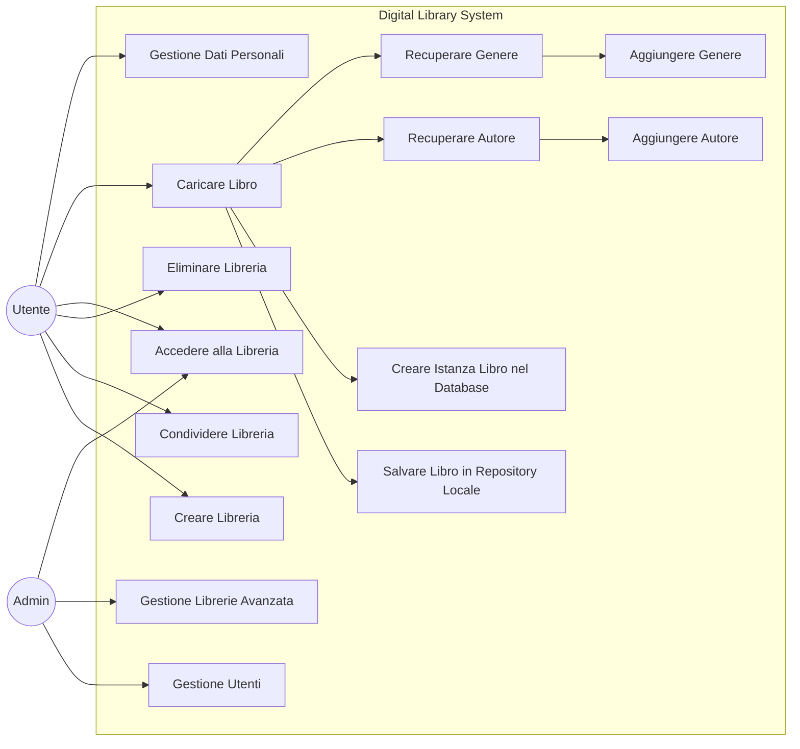
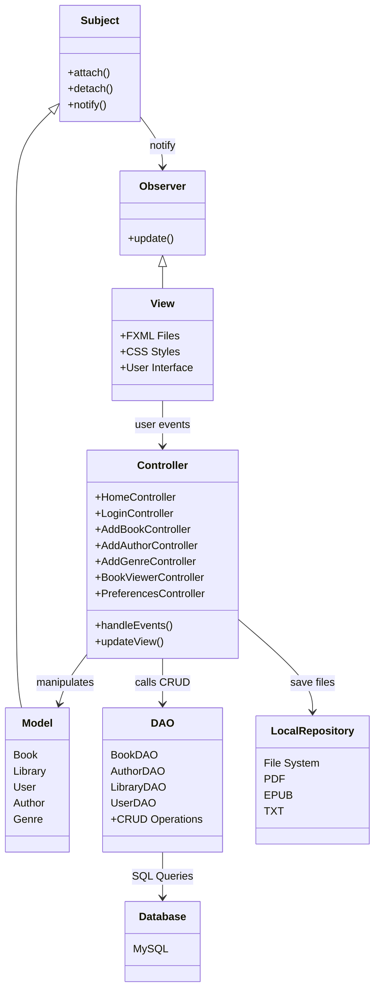
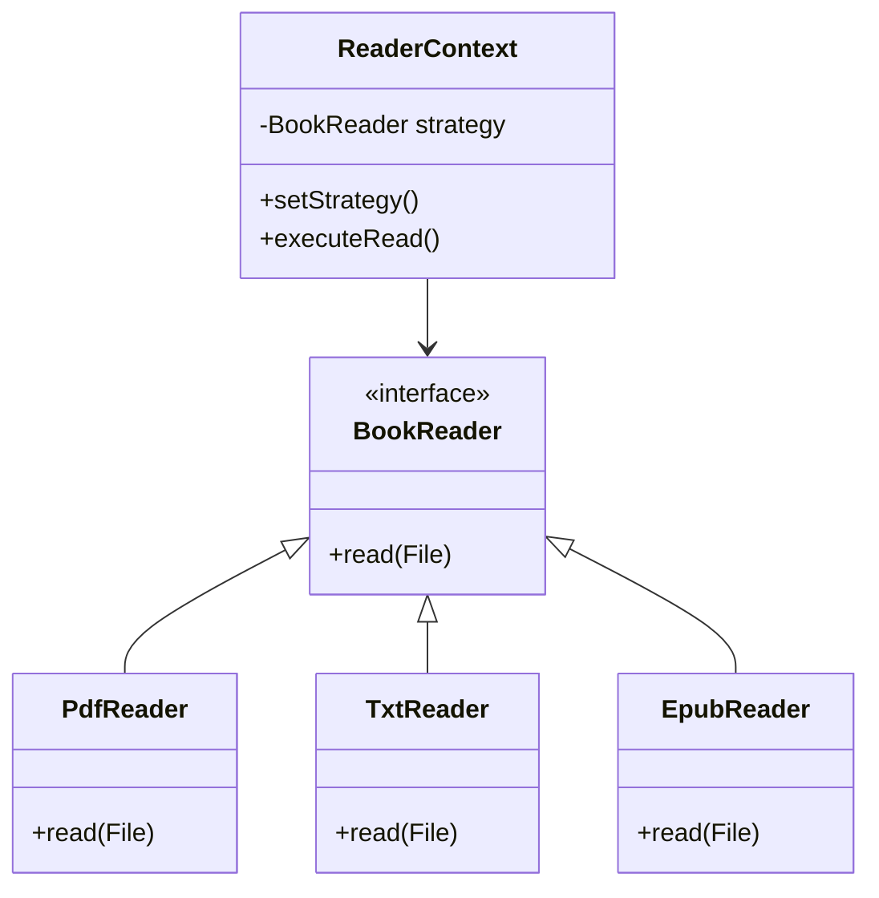
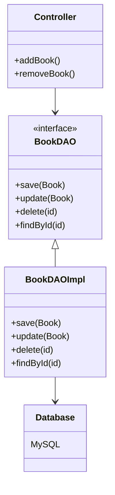

### Progetto Sviluppato da:
_Filippo Cappella_: filippo.cappella@studio.unibo.it
_Luca Vignali_: luca.vignali7@studio.unibo.it
### Obiettivo
Digital Libray è un'applicazione per la gestione dei libri digitali, l'applicazione presenta varie funzioni di gestione delle libreria, dei libri e degli utenti che ne usufruiscono, tutto ciò con una grafica semplice e accattivante.

Qui di seguito sono elencati i requisiti del nostro applicativo:
- Caricamento file di varie estensioni ( PDF, txt, epub )
- Catalogazione per vari attributi ( generi, anno di pubblicazione, autore )
- Filtraggio per attributo
- Lettura dei file selezionati
- Creazione di nuove librerie
- Condivisione della libreria con altri utenti
- Repository centrale e repository personale

Challenge Principali:
- Creazione di una grafica accattivante, semplice e intuitiva
- Lettura dei file per ogni estensione o per più estensioni possibili, utilizzando framework o librerie, come icePDF, usato per la lettura e visualizzazione dei file PDF.
- Creazione di nuove librerie e libri, creandoli nel nostro database e gestiti poi dall'applicativo con le nostre funzioni
- Filtraggio e catalogazione di ogni libro

### Analisi e Modello del Dominio

Digital Library dovrà essere in grado di creare, condividere e eliminare le varie librerie dell'utente, le librerie sono costituite da un insieme di libri associati alla suddetta libreria.
L'utente dev'essere in grado di accedere alla libreria e caricare i propri libri ad essa.
L'applicativo dovrà essere in gradi di salvare i vari libri all'interno della repository locale e creare un'istanza del libro nel database.
Durante la fase di caricamento dei libri l'applicativo dovrà essere in grado di recuperare i dati del genere e dell'autore, dando all'utente la possibilità di aggiungerne di nuovi.
L'applicativo inoltre permetterà la gestione di funzioni admin, funzioni avanzate per la gestione dell'utenza e della libreria.
L'utente potrà gestire i propri dati direttamente dall'applicativo.


### Architettura
L'applicativo è sviluppato con un'architettura a strati (Layered Architecture) combinata con il pattern MVC (Model-View-Controller).

Componenti Architetturali Principali:
1. View (Presentation Layer)
	- File FXML
	- File CSS
2. Controller (Control Layer)
	- Classi Controller (HomeController.java, LoginController.java, AddBookController.java, ecc...)
	- Observer
3. Model (Entity Layer)
	- Classi del package models (Book, Libraries, LibUser, ecc...)
4. DAO (Data Access Layer)
	- Implementazioni per accesso MySQL (BookDAO, AuthorDAO, LibrariesDAO, ecc.)
5. Utilities & Support
	- Package utils
	- Package observers
	- Package strategies

Interazioni tra Componenti principali dell'applicativo:
- **View → Controller**: Gli eventi dell'interfaccia vengono gestiti dai Controller tramite annotazioni @FXML
- **Controller → DAO**: I Controller utilizzano i DAO per operazioni CRUD sul database
- **DAO → Database**: I DAO traducono le operazioni in query SQL verso il database MySQL
- **Controller ↔ Model**: I Controller manipolano i Model per rappresentare lo stato dell'applicazione
- **Subject ↔ Observer**: Observer e Subject comunicano fra di loro ad ogni modifica

Questa architettura segue il principio di separazione delle responsabilità, mantenendo distinti i livelli di presentazione, controllo, logica di business e accesso ai dati.

### Design Dettagliato
#### Gestione Lettura File Multi-Formato (Strategy Pattern)

##### Problema
L’applicativo deve supportare la lettura di libri in formati diversi (PDF, TXT, EPUB), ogni formato richiede una logica di parsing e visualizzazione differente. Una soluzione basata su `if-else` o `switch` avrebbe prodotto codice rigido e difficile da estendere.
##### Soluzione
È stato adottato il **Strategy Pattern**, che consente di incapsulare le diverse strategie di lettura all’interno di classi separate.
Il Controller seleziona dinamicamente la strategia corretta in base all’estensione del file.
##### Alternative valutate

| Soluzione            | Problemi                         |
| -------------------- | -------------------------------- |
| Switch su estensione | Scarsa estendibilità             |
| Classe unica Reader  | Violazione Single Responsibility |
| Strategy Pattern     | ✔ Estensibile e modulare         |
##### UML Strategy Pattern


- **Strategy Interface** → `BookReader`
- **Concrete Strategies** → `PdfReader`, `TxtReader`, `EpubReader`
- **Context** → `ReaderContext` utilizzato dal Controller
##### Benefici
- Aggiunta nuovi formati senza modificare codice esistente
- Migliore separazione delle responsabilità
- Riduzione accoppiamento
#### Gestione Persistenza Dati (DAO Pattern)

##### Problema
L’applicativo deve gestire operazioni CRUD dei dati relativi a libri, utenti e librerie.
Un accesso diretto al database da parte dei Controller avrebbe introdotto un forte accoppiamento tra la logica applicativa e la tecnologia di persistenza, rendendo difficile la manutenzione e l’eventuale sostituzione del database.
##### Soluzione
È stato adottato il **DAO Pattern (Data Access Object)**, che permette di separare la logica di accesso ai dati dalla logica di business dell’applicazione.  
I Controller interagiscono esclusivamente con le interfacce DAO, mentre le implementazioni concrete si occupano di tradurre le operazioni in query SQL verso il database MySQL.
##### Alternative valutate

| Soluzione                | Problemi                     |
| ------------------------ | ---------------------------- |
| Query SQL nei Controller | Forte accoppiamento          |
| Classe DB Manager unica  | Scarsa modularità            |
| DAO Pattern              | ✔ Separazione responsabilità |

##### UML DAO Pattern



- **DAO Interface** → `BookDAO`
- **Concrete DAO** → `BookDAOImpl`
- **Client** → `Controller`
- **Datasource** → Database MySQL
##### Benefici
- Separazione tra logica applicativa e persistenza
- Facilità di manutenzione del codice
- Possibilità di cambiare database senza modificare i Controller
- Migliore testabilità delle componenti
### Note di Sviluppo
#### Estrazione pagine Epub
Dove: src.main.java.com.library.strategies.EpubDisplayStrategy
```
...
List<Resource> chapters = new ArrayList<>();
            for (Resource res : epub.getContents()) {
                String href = res.getHref().toLowerCase();
                if (!href.contains("cover") && !href.contains("titlepage")
                        && (href.endsWith(".html") || href.endsWith(".xhtml"))) {
                    String content = new String(res.getData(), StandardCharsets.UTF_8);
                    if (content.trim().length() > 50) {
                        chapters.add(res);
                    }
                }
            }
...
```
Lettura dei file epub, parse del contenuto HTML e XHTML e estrazione pagine in lista

#### ICEPDF Funzione Toggle Toolbar
Dove: src.main.java.com.library.strategies.PdfDisplayStrategy
```
...
private void toggleToolbar(Button button) {
        toolbarVisible = !toolbarVisible;
        SwingUtilities.invokeLater(() -> {
            controller.setToolBarVisible(toolbarVisible);
            controller.setUtilityPaneVisible(toolbarVisible);
        });

        button.setText(toolbarVisible ? "Nascondi Opzioni" : "Mostra Opzioni");
        button.setStyle(toolbarVisible
            ? "-fx-padding: 10 20; -fx-font-size: 14px; -fx-background-color: #f44336; -fx-text-fill: white; -fx-cursor: hand;"
            : "-fx-padding: 10 20; -fx-font-size: 14px; -fx-background-color: #4CAF50; -fx-text-fill: white; -fx-cursor: hand;");
    }
...
```
Gestione della visualizzazione della toolbar all'interno del Viewer PDF della libreria ICEPDF
#### Controllo ENCODING File TXT
Dove: src.main.java.com.library.strategies.TxtDisplayStrategy
```
...
            if (bytes.length >= 2 && bytes[0] == (byte)0xFF && bytes[1] == (byte)0xFE) {
                content = new String(bytes, StandardCharsets.UTF_16LE);   // UTF-16 LE BOM
            }
            else if (bytes.length >= 2 && bytes[0] == (byte)0xFE && bytes[1] == (byte)0xFF) {
                content = new String(bytes, StandardCharsets.UTF_16BE);   // UTF-16 BE BOM
            }
            else if (bytes.length >= 3 &&
                    bytes[0] == (byte)0xEF &&
                    bytes[1] == (byte)0xBB &&
                    bytes[2] == (byte)0xBF) {
                content = new String(bytes, StandardCharsets.UTF_8);      // UTF-8 BOM
                content = content.replace("\uFEFF", "");
            }
            else {
                content = new String(bytes, StandardCharsets.UTF_8);     // Default UTF-8
            }
            
            content = content.trim();
...
```
Controllo dell'encoding dei file TXT e conversione per lettura
#### Repository Manager con Singletone
Dove: src.main.java.com.library.utils.RepositoryManager
```
private RepositoryManager() {
        File devRepo = new File("library-data");
        this.isProduction = !devRepo.exists() || System.getProperty("app.production") != null;
        
        if (isProduction) {
            this.centralRepositoryPath = getProductionRepositoryPath();
        } else {
            this.centralRepositoryPath = devRepo.getAbsolutePath();
        }
        
        setupCentralRepository();
        
        if (isProduction) {
            syncFromLibraryData();
        }
    }
```
Gestione centralizzata dei file con supporto modalità DEV/PROD
#### Pattern Singletone + factory per DAO
Dove: src.main.java.com.library.DAO.DAOFactory
```
public static synchronized DAOFactory getInstance() {
        if (instance == null) {
            instance = new DAOFactory();
        }
        return instance;
    }
    
    public AuthorDAO getAuthorDAO() { return authorDAO; }
    public BookDAO getBookDAO() { return bookDAO; }
    public GenreDAO getGenreDAO() { return genreDAO; }
    public LibrariesDAO getLibrariesDAO() { return librariesDAO; }
    public LibUserDAO getLibUserDAO() { return libUserDAO; }
```
Factory centralizzata con Singletone per ogni DAO
#### Autocomplete con Stream API e Context Menu
Dove: src.main.java.com.library.controllers.AddBookController
```
private void suggestAuthors(String query) {
        AuthorDAO authorDAO = DAOFactory.getInstance().getAuthorDAO();
        List<Author> authors = authorDAO.findAll();
        authorContextMenu.getItems().clear();
        
        // Usa stream per filtrare e creare menu items
        authors.stream()
            .filter(a -> query == null || query.trim().isEmpty() || 
                         a.getAuthorName().toLowerCase().contains(query.toLowerCase()) ||
                         a.getSurname().toLowerCase().contains(query.toLowerCase()))
            .limit(10) // Limita a 10 suggerimenti per non sovraccaricare il menu
            .forEach(author -> {
                String fullName = author.getAuthorName() + " " + author.getSurname();
                Label menuLabel = new Label(fullName);
                menuLabel.setStyle("-fx-padding: 5 10; -fx-cursor: hand;");
                CustomMenuItem item = new CustomMenuItem(menuLabel, false);
                item.setOnAction(e -> {
                    authorField.setText(fullName);
                    authorContextMenu.hide();
                });
                authorContextMenu.getItems().add(item);
            });
        
        // Mostra il menu se ci sono suggerimenti
        if (!authorContextMenu.getItems().isEmpty()) {
            if (!authorContextMenu.isShowing()) {
                authorContextMenu.show(authorField, javafx.geometry.Side.BOTTOM, 0, 0);
            }
        } else {
            authorContextMenu.hide();
        }
    }
```
Sistema di Autocomplete per autori e generi
### Commenti Finali
